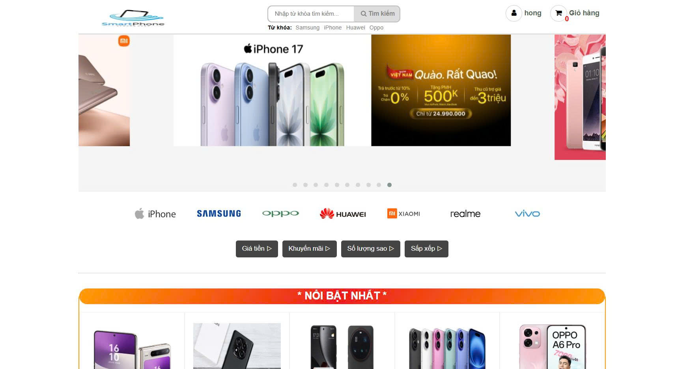
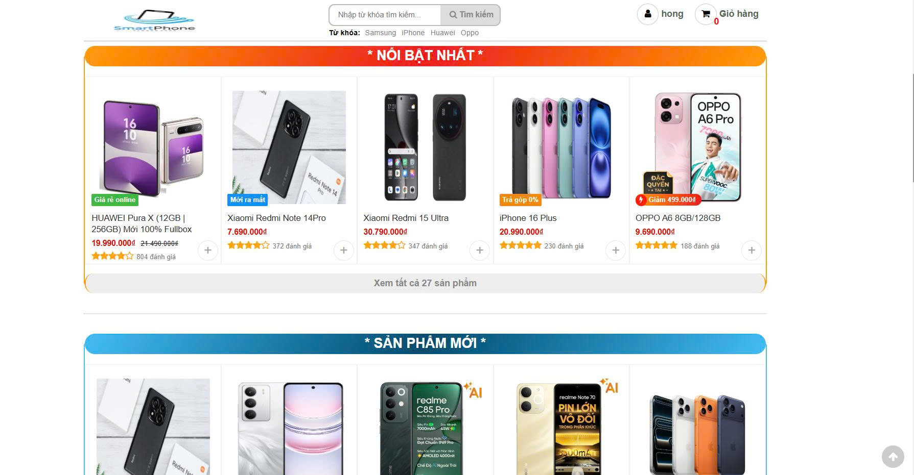
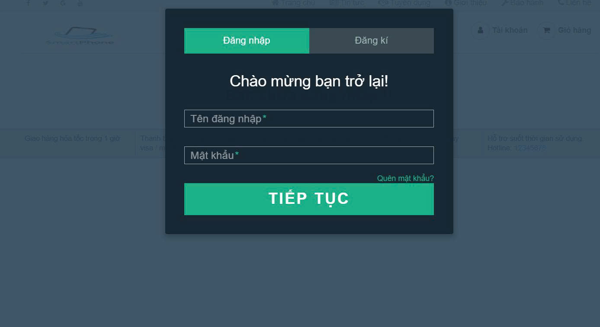
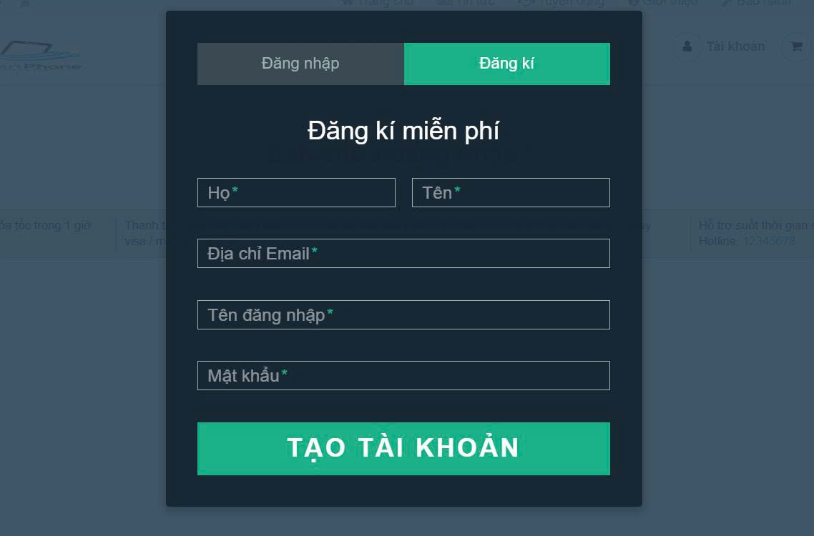
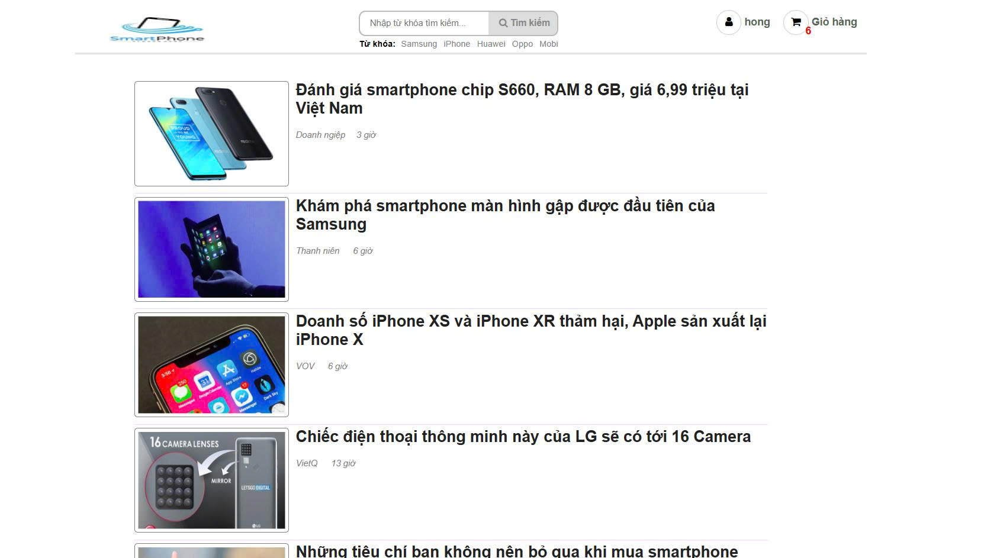
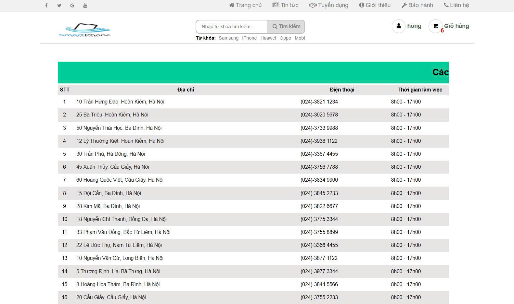
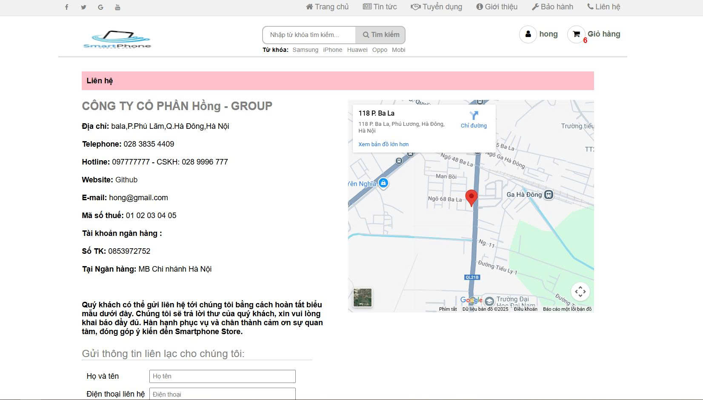
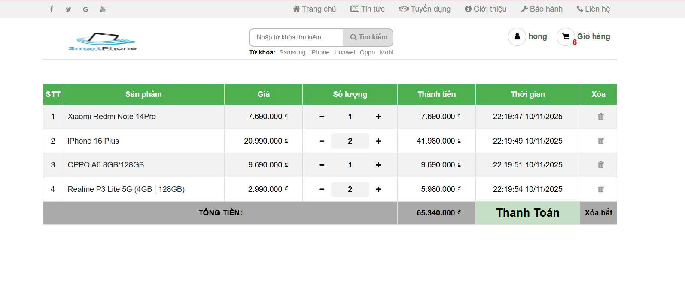
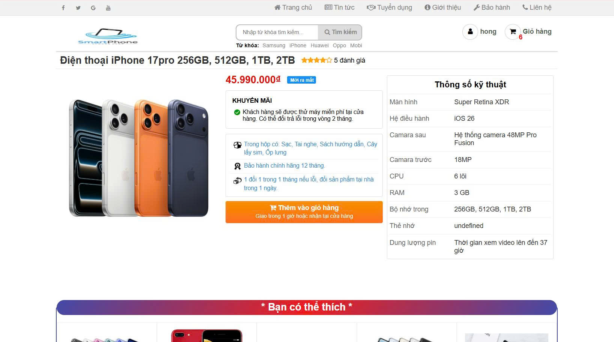
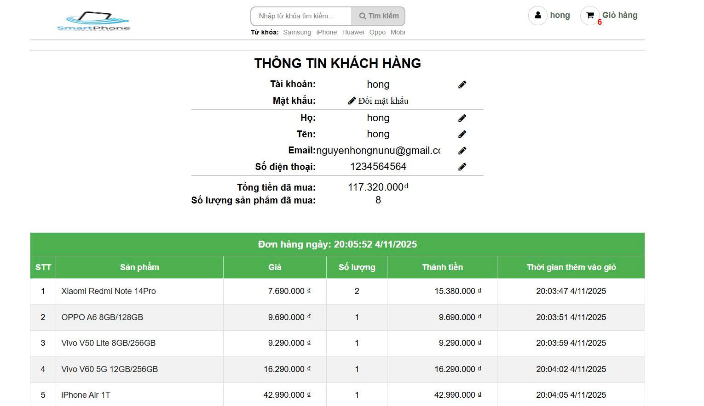

<h2 align="center">
    <a href="https://dainam.edu.vn/vi/khoa-cong-nghe-thong-tin">
    🎓 Faculty of Information Technology (DaiNam University)
    </a>
</h2>
<h2 align="center">
</h2>

    

        
        
        
    

---

    <h2>Đề tài: Chuyển đổi số về mua sắm và thương mại điện tử </h2>
    
 <h3>1. Giới thiệu hệ thống</h3>
    

      Trong bối cảnh cuộc cách mạng công nghiệp 4.0 phát triển mạnh mẽ, chuyển đổi số đã trở thành xu thế tất yếu giúp doanh nghiệp tối ưu hoạt động, nâng cao hiệu quả kinh doanh và mang đến trải nghiệm mới cho người tiêu dùng. Ngành mua sắm và thương mại điện tử là một trong những lĩnh vực chịu ảnh hưởng sâu sắc nhất từ xu hướng này. Hệ thống chuyển đổi số trong mua sắm và thương mại điện tử mà chúng tôi xây dựng hướng đến việc số hóa toàn bộ quy trình mua bán, từ khâu trưng bày sản phẩm, quản lý đơn hàng, thanh toán trực tuyến đến chăm sóc khách hàng. Hệ thống giúp người mua dễ dàng tìm kiếm, so sánh và đặt hàng trực tuyến
      Hệ thống là minh chứng cho việc ứng dụng công nghệ thông tin vào lĩnh vực thương mại, góp phần vào quá trình chuyển đổi số quốc gia, hướng tới nền kinh tế số hiện đại và bền vững.
    

    
 
Các chức năng chính:

    <ul style="font-size: 16px; line-height: 1.6;">
        <li>Đăng ký và đăng nhập tài khoản người dùng</li>
        <li>Xem danh sách sản phẩm </li>
        <li>Tìm kiếm và lọc sản phẩm</li>
        <li>Xem chi tiết sản phẩm</li>
        <li>Thêm sản phẩm vào giỏ hàng</li>
        <li>Đặt hàng và thanh toán</li>
    </ul>

## 2. Ngôn ngữ & Công nghệ chính

 
Ngôn ngữ lập trình: JavaScript, HTML, CSS  

     <ul style="font-size: 16px; line-height: 1.6;">
        <li>Công nghệ web Front-end: Website được xây dựng dựa trên nền tảng Front-end Web Development, toàn bộ xử lý diễn ra trên trình duyệt người dùng (client side). JavaScript được sử dụng để thao tác dữ liệu và điều khiển giao diện, không cần máy chủ xử lý phức tạp.</li>
        <li>Công nghệ lưu trữ cục bộ: Sử dụng Local Storage / Session Storage của trình duyệt để lưu tạm thông tin giỏ hàng hoặc người dùng (nếu chưa kết nối cơ sở dữ liệu thật).</li>
        </ul>
  

 
      

Công cụ hỗ trợ phát triển: 

    <ul style="font-size: 16px; line-height: 1.6;">
                                                   <li>Visual Studio Code: Trình soạn thảo mã nguồn chính, hỗ trợ cú pháp HTML, CSS, JavaScript.
                                                   <li> Google Chrome / Microsoft Edge: Trình duyệt dùng để chạy thử và kiểm tra giao diện website.
                                                   <li> GitHub: Dùng để lưu trữ và quản lý mã nguồn dự án trực tuyến. </li>

## 3. Hình ảnh các chức năng

    

         
        <i>Hình 1: Trang chủ<i>  
         
         <i>Hình 2: Sản phẩm trong trang chủ<i>  
         
        <i>Hình 3: Form đăng nhập <i>  
          
        <i>Hình 4: Form đăng ký <i>  
          
         <i>Hình 5: Trang tin tức<i>  
          
         <i>Hình 6: Trang tuyển dụng <i>  
           
         <i>Hình 7: Trang những địa điểm bảo hành <i>  
           
         <i>Hình 8: Trang thông tin liên hệ <i>  
          
         <i>Hình 9: Giỏ hàng và thanh toán <i>  
           
         <i>Hình 10: Chi tiết sản phẩm <i>  
           
         <i>Hình 11: Trang người  <i>  
    

##  📝 4. Hướng dẫn cài đặt và sử dụng ứng dụng 
**🔧Yêu cầu hệ thống**
- **Hệ điều hành**: Windows, macOS, hoặc Linux
- **Trình duyệt web**: Google Chrome, Microsoft Edge hoặc Firefox (phiên bản mới nhất).
- **Phần mềm hỗ trợ lập trình**: Visual Studio Code (hoặc bất kỳ trình soạn thảo mã nguồn nào khác).
- **Kết nối Internet**: Dùng để tải ảnh, thư viện CSS/JS

 **📦 Hướng dẫn sử dụng ứng dụng** 
 Xem video hướng dẫn tại đây : https://drive.google.com/file/d/1jEvv9PQb9pX6BslCed56R3liWM4Jy_MM/view?usp=drive_link  

---
## 5. Liên hệ
- Họ và tên: Nguyễn Thu Hồng
- Lớp: CNTT 16-04
- Email: nguyenhongnunu@gmail.com
- © 2025 AIoTLab, Faculty of Information Technology, DaiNam University. All rights reserved.
---
